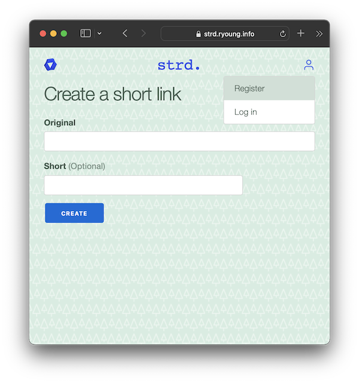

# Strd
A URL Shortener exercise

[https://strd.ryoung.info](strd.ryoung.info)




## Setup
```bash
$ # ensure docker is running
$ make setup
```
This will build the application, create the database, and run the migrations.  

Note: It's possible this may fail the first time, as the web server may try to connect to the db before it is ready to accept connections.  If this happens, you can run this command again.

## Running the app
```bash
$ make server
```
This runs `docker-compose up` to spin up the phoenix service and the postgres db.  Once this is running, you should be able to navigate to [http://localhost:8080](http://localhost:8080) and see the app running.

## Running the tests
To run the tests locally, run
```bash
$ make test
```

Alternatively, the test suite will be run automatically on any pull request or commit pushed to the `main` branch on Github via a Github Action.
